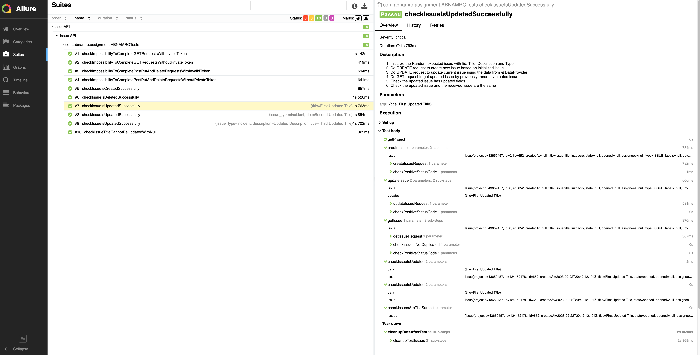

# ABN AMRO Backend Test Automation Assignment

  Automation tests for IssueAPI of gitlab.

### Prerequisites:
* Java 11 (JDK) 
* Maven 3.3+ 
* Git

### Main Instruction:
* Clone the project: `git clone https://github.com/MatthewProk/abn-qa-backend-assingment.git`
* Navigate to the root directory of the project
* Run test using terminal: `mvn clean install`
* Generate and open report : `mvn allure:serve`

### Additional Instruction:
* Run security tests using terminal: `mvn clean install -PRunSecurityTests`

### What was used: 
* [Rest-Assured](https://rest-assured.io/) - Java-based library for testing REST APIs.
* [TestNG](https://testng.org/) - Testing framework for the Java programming language created
* [Allure Report](https://qameta.io/) - Open-source test reporting framework.
* [Maven](https://maven.apache.org/) - Dependency management framework for Java-based projects

### Allure Report:

### Author:

* **Matsvei Hrytsuk**

